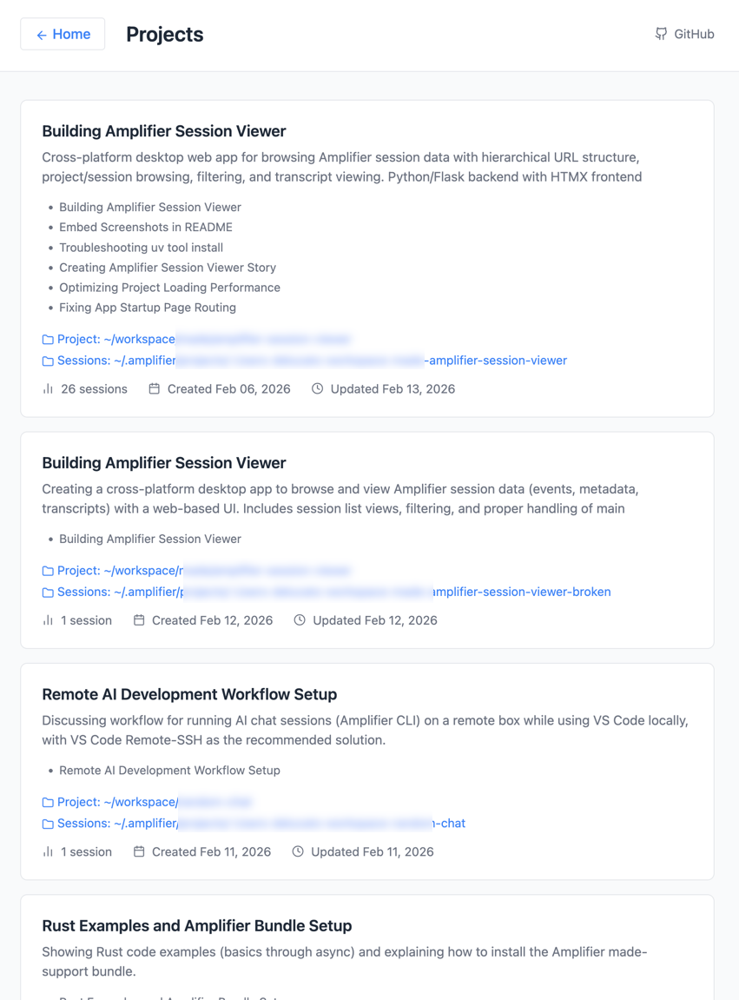
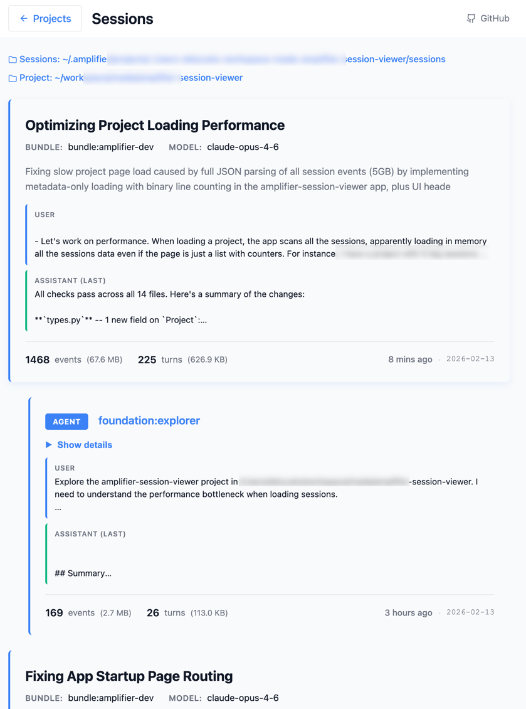
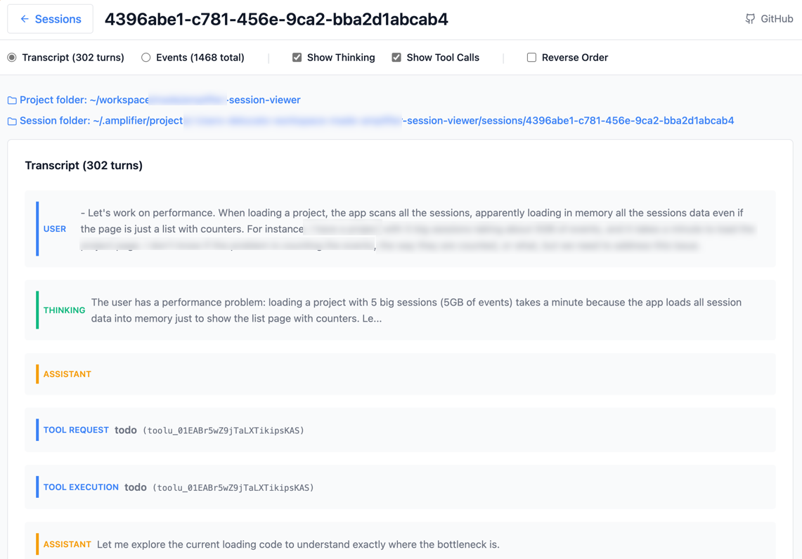

# Amplifier Sessions

A fast, lightweight web viewer for [Amplifier](https://github.com/microsoft/amplifier) sessions. Browse projects, explore event timelines, filter by type/agent/timestamp, and read transcripts -- all from your browser.

Runs locally. No database, no config, no authentication. Just point it at a directory and go.

## Screenshots

### Projects

All your Amplifier projects in one place, with session names, metadata, and quick links to open folders.



### Sessions

Each project's sessions organized in a parent/child hierarchy. First and last messages are shown inline, truncated and expandable.



### Session Detail

Full transcript and event timeline with filters, toggles, and collapsible details.



## Installation

### Quick Try (No Installation)

```bash
uvx --from git+https://github.com/dluc/amplifier-sessions.git python -m amplifier_sessions
```

### Using `uv` (Recommended)

```bash
uv tool install git+https://github.com/dluc/amplifier-sessions
```

### From Source

```bash
git clone https://github.com/dluc/amplifier-sessions
cd amplifier-sessions
uv venv
source .venv/bin/activate
uv pip install -e .
```

## Usage

Run `amplifier-sessions` from a directory where you've used the Amplifier CLI. The tool finds sessions in `~/.amplifier/projects/` based on the directory you launch from.

### From a project directory

```bash
cd /path/to/your/amplifier/project
amplifier-sessions
```

The app calculates the folder slug, scans `~/.amplifier/projects/<slug>/sessions/`, and opens the sessions list in your browser.

### From a sessions directory

```bash
cd ~/.amplifier/projects/<slug>/sessions
amplifier-sessions
```

The app detects it's inside a sessions directory and loads sessions directly.

### Options

```bash
amplifier-sessions --dir /path/to/project   # Specify a directory
amplifier-sessions --port 8080              # Use a specific port
```

## What You'll See

The app has four pages, each linked from the previous:

| Page | URL | What it shows |
|------|-----|---------------|
| **Landing** | `/` | Welcome page with a link to the projects browser |
| **Projects** | `/projects/` | All Amplifier projects with session names, metadata, and folder links |
| **Sessions** | `/projects/<slug>` | All sessions for a project in a parent/child tree, with first/last message previews |
| **Session Detail** | `/session/<id>` | Full transcript and event timeline with filters |

### Session Detail Features

- **Transcript view** -- collapsible user/assistant/tool turns with thinking blocks
- **Events view** -- color-coded timeline with a sidebar filter panel
- **Filters** -- event type, agent name, time range, errors only, tool calls only, text search
- **Toggles** -- show/hide thinking blocks, show/hide tool calls, reverse order
- **Folder links** -- open the project or session directory in your OS file manager

## Performance

The app is designed to handle large sessions (multi-GB event logs) without pain:

- **Lazy loading** -- sessions are never parsed at startup; only when you open one
- **Metadata-only list pages** -- the projects and sessions lists read only `metadata.json` and count lines via fast binary reads; event/transcript JSON is never parsed
- **Tail reads** -- timestamps and last messages are extracted by reading only the last 64KB of each file, regardless of file size
- **Page cache** -- rendered HTML for project and session list pages is cached (LRU, max 20 entries) so repeat visits are instant
- **HTMX partials** -- view switching and filter application replace only the changed fragment, not the full page

## Uninstallation

```bash
uv tool uninstall amplifier-sessions
```

## Troubleshooting

### "amplifier-sessions: command not found" after installation

`uv tool install` places the command in `~/.local/bin/`. If your shell doesn't include that directory in `PATH`:

```bash
# Check the binary exists
ls -la ~/.local/bin/amplifier-sessions

# Add to PATH (zsh)
echo 'export PATH="$HOME/.local/bin:$PATH"' >> ~/.zshrc
source ~/.zshrc

# Add to PATH (bash)
echo 'export PATH="$HOME/.local/bin:$PATH"' >> ~/.bash_profile
source ~/.bash_profile
```

## Tech Stack

- **Python 3.10+** with only 2 runtime dependencies: Flask and Pydantic
- **HTMX** for partial page updates (bundled locally)
- **Lucide** for icons (loaded from CDN)

## License

MIT
